# Домашнее задание 1 <!-- omit from toc -->

## Содержание <!-- omit from toc -->

- [1 Соискатель](#1-соискатель)
  - [1.1 Страница авторизации](#11-страница-авторизации)
  - [1.2 Страница регистрации](#12-страница-регистрации)
  - [1.3 Страница вакансий](#13-страница-вакансий)

Проект доступен по [ссылке](http://212.233.90.231:8085/vacs).

## 1 Соискатель

### 1.1 Страница авторизации

Форма авторизации соискателем представлена на рисунке

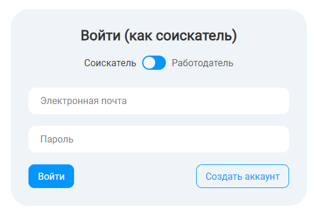

- поле `Электронная почта`:

  - валидация происходит по регулярному выражению `/.+@.+\..+$g`

  - при ошибке валидации выводится соответсвующее сообщение об ошибке

    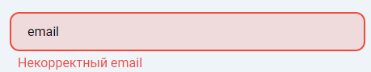

  - при вводе одних пробелов в поле возникает следующее сообщение об ошибке

    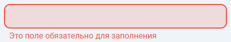

  - при вводе нескольких слов в поле, возникает следующее сообщение об ошибке

    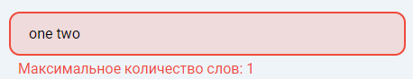

  - при валидном значении в поле сообщения не возникает

- <bug>⚠ BUG:</bug> при попытке отправки пустых полей в каждом поле возникает сообщение об ошибке

  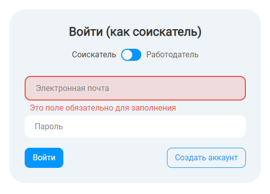

- при отправке неверных данных возникает общая ошибка

  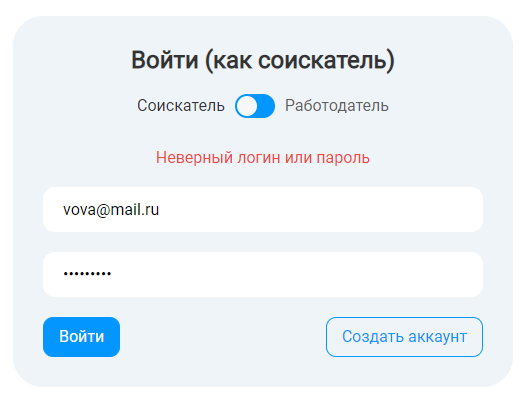

- при всех валидных заполненных полях сообщений об ошибках нет, пользователя редиректит на страницу с вакансиями

### 1.2 Страница регистрации

Форма регистрации соискателем представлена на рисунке
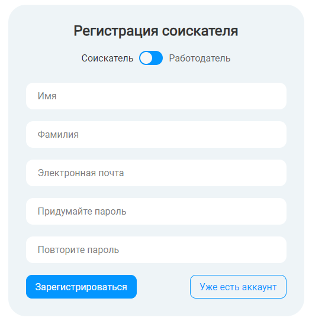

- поля формы `Имя`, `Фамилия`:

  - обязательные поля для заполнения, иначе, если не заполнены или заполнены пробелами, то выводится сообщения об ошибке

    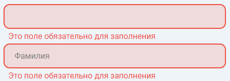

  - должны содержать одно слово, иначе выводится сообщение об ошибке

    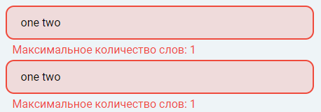

  - не должны содержать цифр, иначе выводится сообщение об ошибке

    

  - не должны быть длиннее 20 символов, иначе выводится сообщение об ошибке

    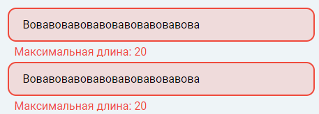

- поле `Электронная почта`

  - валидация происходит по регулярному выражению `/.+@.+\..+$g`

  - должно содержать одно слово, иначе выводится сообщение об ошибке

    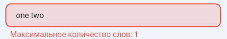

  - при невалидном значении выводится сообщение об ошибке

    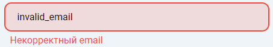

  - в ситуации, когда пользователь с введенной электронной почтой уже существует, выводится общее сообщение об ошибке

    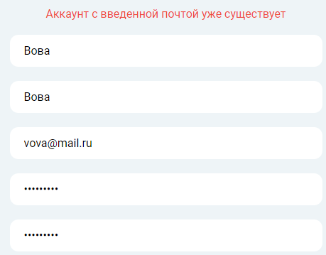

  - при некорректном домене почты выведится общее сообщение об ошибке

    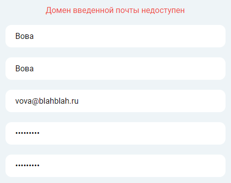

- поле `Придумайте пароль`:

  - обязательное поле для заполнения
  - требования к сложности пароля:
    - должен быть от 6 до 128 символов в длину
    - должен содержать заглавные буквы
    - должен содержать цифры
  - при неудовлетварении требованиям сложности пароля выводится сообщение об ошибке

    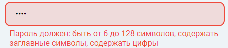

- поле `Повторите пароль`:

  - должно совпадать со значением в поле `Придумайте пароль`, иначе выводится сообщение об ошибке

    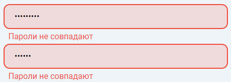

- при отсутствии ошибок, сообщений нет, пользователя редиректит на страницу с вакансиями

### 1.3 Страница вакансий
