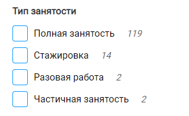
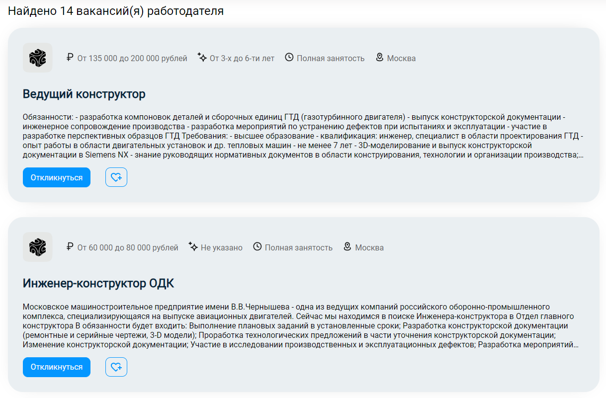
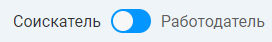

# Домашнее задание 1 <!-- omit from toc -->

## Содержание <!-- omit from toc -->

- [1. Соискатель](#1-соискатель)
  - [1.1. Страница авторизации](#11-страница-авторизации)
  - [1.2. Страница регистрации](#12-страница-регистрации)
  - [1.3. Хедер](#13-хедер)
  - [1.4. Список вакансий](#14-список-вакансий)
    - [1.4.1. Фильтры](#141-фильтры)
    - [1.4.2. Список](#142-список)
  - [1.5. Страница вакансии](#15-страница-вакансии)
    - [1.5.1. Отклик](#151-отклик)
  - [1.6. Страница компании](#16-страница-компании)
  - [1.7. Страница профиля пользователя](#17-страница-профиля-пользователя)
    - [1.7.1. Настройки](#171-настройки)
    - [1.7.2. Отклики](#172-отклики)
    - [1.7.3. Резюме](#173-резюме)
  - [1.8. Резюме](#18-резюме)
    - [1.8.1. Создание резюме](#181-создание-резюме)
      - [1.8.1.1. Основная информация](#1811-основная-информация)
      - [1.8.1.2. Информация об образовании](#1812-информация-об-образовании)
      - [1.8.1.3. Информация об опыте работы](#1813-информация-об-опыте-работы)
      - [1.8.1.4. Информация о Вас](#1814-информация-о-вас)
    - [1.8.2. Редактирование резюме](#182-редактирование-резюме)
      - [1.8.2.1. Блоки основной информации](#1821-блоки-основной-информации)
      - [1.8.2.2. Блок общей информации](#1822-блок-общей-информации)
- [2. Работодатель](#2-работодатель)
  - [2.1. Страница авторизации](#21-страница-авторизации)
  - [2.2. Страница регистрации](#22-страница-регистрации)
  - [2.3. Хедер](#23-хедер)

Проект доступен по [ссылке](http://212.233.90.231:8085/vacs).

## 1. Соискатель

### 1.1. Страница авторизации

Форма авторизации соискателем представлена на рисунке

- поле `Электронная почта`:

  - валидация происходит по регулярному выражению `/.+@.+\..+$g`

  - при ошибке валидации выводится соответсвующее сообщение об ошибке

    

  - при вводе одних пробелов в поле возникает следующее сообщение об ошибке

    

  - при вводе нескольких слов в поле, возникает следующее сообщение об ошибке

    

  - при валидном значении в поле сообщения не возникает

- <bug>⚠ BUG:</bug> при попытке отправки пустых полей в каждом поле возникает сообщение об ошибке

  

- при отправке неверных данных возникает общая ошибка

  

- при всех валидных заполненных полях сообщений об ошибках нет, пользователя редиректит на страницу с вакансиями

### 1.2. Страница регистрации

Форма регистрации соискателем представлена на рисунке

- поля формы `Имя`, `Фамилия`:

  - обязательные поля для заполнения, иначе, если не заполнены или заполнены пробелами, то выводится сообщения об ошибке

    

  - должны содержать одно слово, иначе выводится сообщение об ошибке

    

  - не должны содержать цифр, иначе выводится сообщение об ошибке

    

  - не должны быть длиннее 20 символов, иначе выводится сообщение об ошибке

    

- поле `Электронная почта`

  - валидация происходит по регулярному выражению `/.+@.+\..+$g`

  - должно содержать одно слово, иначе выводится сообщение об ошибке

    

  - при невалидном значении выводится сообщение об ошибке

    

  - в ситуации, когда пользователь с введенной электронной почтой уже существует, выводится общее сообщение об ошибке

    

  - при некорректном домене почты выведится общее сообщение об ошибке

    

- поле `Придумайте пароль`:

  - обязательное поле для заполнения
  - требования к сложности пароля:
    - должен быть от 6 до 128 символов в длину
    - должен содержать заглавные буквы
    - должен содержать цифры
  - при неудовлетварении требованиям сложности пароля выводится сообщение об ошибке

    

- поле `Повторите пароль`:

  - должно совпадать со значением в поле `Придумайте пароль`, иначе выводится сообщение об ошибке

    

- при отсутствии ошибок, сообщений нет, пользователя редиректит на страницу с вакансиями

### 1.3. Хедер

Хедер у авторизованного соискателя выглядит следующим образом

- лого содерижит ссылку на главную страницу сайта
- кнопка `Мои резюме` ведет на страницу с резюме пользователя
- кнопка `Соискатели` ведет на страницу со списком соискателей
- кнопка `Вакансии` ведет на страницу со списком доступных вакансий
- при нажатии на кнопку поиска появляется поисковая строка, все элеменры слева кроме лого скрываются

  

  - по кнопке слева можно установить, где будет происходить поиск
  - по кнопке справа выполняется сам поиск
  - по черной стрелке справа строка скрывается

- кнопка `Создать резюме` ведет на странцу создать резюме
- кнопка в виде сердца ведет к избранным вакансиям пользователя
- при нажатии на кнопку `бургер` иконка поворачивается на 90° и появляется всплывающее меню

  

  - кнопка `Профиль` ведет в раздел профиля пользователя
  - кнопка `Отклики` ведет в раздел откликов пользователя
  - <bug>⚠ BUG:</bug> кнопка `Сменить роль` переводит пользователя из соискателя в работодателя, если он создавал аккаунт с другой ролью до этого, иначе ведет на страницу создания новой роли для его электронной почты
  - кнопка `Выход из аккаунта` происходит разлогинивание пользователя

### 1.4. Список вакансий

Часть страницы со списком вакансий выглядит следующим образом

#### 1.4.1. Фильтры

- компонент с фильтрами располагается слева на странице
- сверху, над всеми фильтрами, показывается строка с количеством найденных вакансий, удовлетворяющих выбранным фильтрам
- если фильтры никакие не выбраны, то выводятся все доступные вакансии, также сверху появляется кнопка сброса всех вакансий

  

- применение фильтров происходит в момент выбора фильтров, либо по нажатию соответствующей кнопки `Применить`
- у некоторых фильтров справа есть значения, которые показывают количество вакансий, соответствующих этому значению фильтра

  - <bug>⚠ BUG:</bug> обновление этих значений происходит следующим образом: значения одного конкретного фильтра рассчитываются для списка вакансий, к которому не применен текущий этот один конкретный фильтр

- фильтр `Город`

  - выводит список 5 самых популярных городов
  - слева от названия города выводится количество вакансий, соответвующих этому городу
  - при выборе города список вакансий обновляется

    

  - <bug>⚠ BUG:</bug> при вводе города, отсутствующего в списке, в строку, применение фильтра проиходит по нажатии кнопки `Применить`, при этом этот город появляется в списке

    

- фильтр `Уровень дохода`

  

  - если не был настроен, по умолчанию принимает значения от самого минимального во всем списке, до самого максимального
    - <bug>⚠ BUG:</bug> при применении других фильтров принимает значения, согласно изначальному полному списку
  - фильтр применяется по нажатии на кнопку `Применить`
  - <bug>⚠ BUG:</bug> при вводе невалидных значений (напрмер от большего к меньшего), выводится сообщение об ошибке
  - при регулировании уровня зарплат ползунками, выставить невалидные значения не получится

- фильтры `Опыт работы`, `Тип занятости`, `Образование`

  

  

  

  - представляют список фильтров из значений, которые хоть раз встречаются в списке изначальном вакансий

#### 1.4.2. Список

- компонент со списком вакансий располагается в правой части страницы

  

- правая верхняя кнопка меняет тип карточек вакансий

  

- карточка вакансии

  

  - в карточке указано название компании и ее лого
  - в карточке указаны основные характеристики вакансии `Зарплата`, `Требуемый опыт`, `Занятость`, `Расположение`

    - при наведении на каждую из них появляется пояснение, что эта иконка означает

      

  - в карточке указано название вакансии
  - в карточке дано сокращенное описание вакансии с многоточием в конце, если текста слишком много
  - при нажатии на кнопку `Откликнуться` пользователя переводит на страницу выбора резюме для отклика
    - <bug>⚠ BUG:</bug> при отклике на вакансию и успешном выполнении дальнейших действий, пользователя возвращает обратно на ту же страницу со списком вакансий, со всеми исходными фильтрами
  - при нажатии на кнопку `сердце с плюсом`, вакансия добавляется в избранное и кнопка меняется на `сердце с минусом`, аналогично работает и в обратную сторну

    

    

    - в дальнейшем все вакансии, которые добавлены в избранное, по-умолчанию отображают кнопку `сердце с минусом`

- пагинатор

  

  - <bug>⚠ BUG:</bug> отображает текущую страницу, количество всех страниц и часть соседних страниц

### 1.5. Страница вакансии

Страница вакансии выглядит следующи образом

- сверху вакансии находится оснавная информация о вакансии
  - все элементы работают аналогично соответствущюим элементам в карточке вакансии списка вакансий
- справа находится краткая информация о компании с ее логи и дата обновления вакансии

  - по нажатии переводит на [страницу компании](#16-страница-компании)

  

- остальную часть страницы занимает описание вакансии
- сверху вакансии кнопка `Назад`, по нажатии которой пользователь возвращается обратно к списку вакансий с сохранением состояния

#### 1.5.1. Отклик

При нажатии кнопки `Откликнуться` на любой вакансии открывается окно с выбором резюме, которым необходимо откликнуться.

Если резюме на аккаунте еще не создавались, то выводится следующая информация.

По кнопке `создадим` пользователя переводит на страницу [создания резюме](#181-создание-резюме).

При нажатии кнопки `Отправить отклик` отклик отправляется и пользователя переводит на оснвоную страницу вакансии. <bug>⚠ BUG:</bug> Вместо этого пользователю показывает сообщенгие об ошибке, хотя отклик проходит.

### 1.6. Страница компании

Страница компании состоит из нескольких компонентов

- основная информация о компании

  

  - имя и фамилия работодателя
  - название компании
  - лого компании
  - иконка роли, при наведении на которую появляется дополнительная информация

    

- список вакансий компании

  

  - сверху распологается информация о количестве вакансий
  - ниже - карточки вакансий, отображаются аналогично карточкам вакансий в общем [списке вакансий](#14-список-вакансий), кроме названия компании, которого нет

### 1.7. Страница профиля пользователя

На странице авторизированного соискателя находится блок с основной информацией о пользователе

В нем есть:

- аватар пользователя
  - при нажатии на аватар открывается окно выбора файла в качестве нового аватара
- имя и фамилия пользователя
- электронная почта пользователя
- иконка роли пользователя

  - при наведении на нее появляется подсказка с названием роли

    

- кнопки разделов профиля `Настройки`, `Отклики`, `Резюме`
  - при переходе в нужный раздел, кнопка раздела выделяется акцентным синим цветом и подчеркивается
  - по-умолчанию, при переходе в профиль, открывается раздел с настройками

#### 1.7.1. Настройки

В разделе `Настройки` можно поменять основную информацию о пользователе

- при нажатии на кнопку `Изменить` у любого поля появляются дополнительные поля
  - при нажатии появившейся кнопки `Применить` введенные значения валидируются и при успешной проверке применяются
  - при нажатии появившейся кнопки `Отменить` все введенные изменения отменяются
- поле `ФИО`

  

  - поля `Имя` и `Фамилия`

    - если не заполнены или заполнены пробелами, то выводится сообщения об ошибке

      

    - должны содержать одно слово, иначе выводится сообщение об ошибке

      

    - не должны содержать цифр, иначе выводится сообщение об ошибке

      

    - не должны быть длиннее 20 символов, иначе выводится сообщение об ошибке

      

    - для применения изменений настроек имени и фамилии вводится пароль от аккаунта

      - при вводе верного пароля настройки применяются
      - <bug>⚠ BUG:</bug> при вводе неверного пароля показывается только ошибка и все заполненные поля сохраняют новые значения, а не сбрасывают их на изначальные

        

  - поле `Почта`

    - валидация происходит по регулярному выражению `/.+@.+\..+$g`
    - должно содержать одно слово, иначе выводится сообщение об ошибке

      

    - при невалидном значении выводится сообщение об ошибке

      

    - <bug>⚠ BUG:</bug> в ситуации, когда пользователь с введенной электронной почтой уже существует, выводится общее сообщение об ошибке
    - <bug>⚠ BUG:</bug> при некорректном домене почты выведится общее сообщение об ошибке

    - для применения изменений настроек имени и фамилии вводится пароль от аккаунта
      - аналогично, как у поля `ФИО`

  - поле `Пароль`

    - поле `Старый пароль`:
      - для применения изменений настроек имени и фамилии вводится пароль от аккаунта
      - аналогично, как у поля `ФИО` и `Почта`
    - поле `Новый пароль`:

      - обязательное поле для заполнения
      - требования к сложности пароля:
        - должен быть от 6 до 128 символов в длину
        - должен содержать заглавные буквы
        - должен содержать цифры
      - при неудовлетварении требованиям сложности пароля выводится сообщение об ошибке

        

    - поле `Повторите пароль`:

      - обязательно для заполнения, если не заполнено, то выводится сообщение об ошибке

        

      - должно совпадать со значением в поле `Новый пароль`, иначе выводится сообщение об ошибке

        

#### 1.7.2. Отклики

В разделе профиля `Отклики` показываются все отклики пользователя

На откликах отображаются:

- статус отклика
- название вакансии
- название компании
- дата отклика

При отсутствии откликов показывается следующее сообщение

#### 1.7.3. Резюме

В разделе профиля `Резюме` показываются все резюме пользователя

При нажатии на кнопку `Редактировать` пользователя переводит на [страницу редактирования резюме](#182-редактирование-резюме)

При нажатии на кнопку `Создать новое резюме` пользователя переводит на [страницу создания резюме](#181-создание-резюме)

При отсутствии резюме у пользователя показывается следующее сообщение

### 1.8. Резюме

#### 1.8.1. Создание резюме

Создание резюме состоит из 4 основных шагов. Справа на экране показаны они показаны Текущий этап выделяется акцентным цветом

##### 1.8.1.1. Основная информация

- поле `Профессия`
  - обязательное для заполнения поле, при пропуске или заполнении пробелами выводится сообщение об ошибке
- поля `Имя`, `Фамилия`
  - обязательные для заполнения поле, при пропуске или заполнении пробелами выводится сообщение об ошибке
  - должны содержать только одно слово, иначе выведится сообщение об ошибке
  - не должны содержать цифр, иначе выведется сообщение об ошибке
- поле `Отчество`
  - не обязательное поле для заполнения
  - может содержать несколько слов
  - не может содержать цифры, при наличии цифр появляется сообщение об ошибке
- поле `Пол`
  - выбирается из двух вариантов
  - выбор обязателен
- поле `Дата рождения`

  - обязательные для заполнения поле, при пропуске или заполнении пробелами выводится сообщение об ошибке
  - <bug>⚠ BUG:</bug> должно содержать валидную дату, если дата невалидна, то выводится сообщение об ошибке

    

- поле `Город`
  - обязательные для заполнения поле, при пропуске или заполнении пробелами выводится сообщение об ошибке

Пример полей с сообщениями об ошибках

- при попытке нажать кнопку `Сохранить и продолжить` с ошибками, ничего не происходит, если ошибок нет, то переходит на следующий шаг

##### 1.8.1.2. Информация об образовании

- поле `Уровень образования`

  - обязательный выбор одного из значений
    - `Нет образования`
    - `Среднее`
    - `Среднее специальное`
    - `Неоконченное высшее`
    - `Высшее`
    - `Бакалавр`
    - `Магистр`
    - `Кандидат наук`
    - `Доктор наук`
  - по-умолчанию выбор стоит на значении `Нет образования`

    - при этом значении дальше никаких полей не появляется

      

    - при выборе любого другого значения появляются дополнительные поля с кнопкой `Добавить учебное заведение`

      

- поля `Учебное заведение`, `Специализация`
  - обязательные для заполнения поле, при пропуске или заполнении пробелами выводится сообщение об ошибке
- поле `Год окончания`

  - обязателен для заполнения поле, при пропуске или заполнении пробелами выводится сообщение об ошибке
  - должен содержать 4 цифры, иначе выводит сообщение об ошибке

  

- при нажатии на кнопку `Добавить учебное заведение` появляется дополнительный блок с данными об учебном заведении и у каждого блока дополнительно появляется кнопка `Удалить учебное заведение`

  

- при нажатии на кнопку `Удалить учебное заведение` соответствующий блок удаляется
- при попытке нажать кнопку `Сохранить и продолжить` с ошибками, ничего не происходит, если ошибок нет, то переходит на следующий шаг
- при попытке нажать на кнопку `Назад`, переходит на предыдущий шаг
  - при возвращении обратно на шаг, с которого ушли, все заполненные данные сохраняются

##### 1.8.1.3. Информация об опыте работы

- по-умолчанию появляется только один чекбокс с текстом `У меня есть опыт работы`

  

- при выборе этого чекбокса появляются дополнительные поля

  

- все поля обязательны, при попытке оставить их пустыми или заполнить только пробелами выводится сообщение об ошибке

  

- при выборе чекбокса `Добавить дату окончания` дополнительное поле с датой окончания работы

- <bug>⚠ BUG:</bug> при вводе невалидных дат выводится сообщение об ошибке

  

- при нажатии на кнопку `Добавить место работы` появляется дополнительный блок с данными о месте работы и у каждого блока дополнительно появляется кнопка `Удалить место работы`

  

- при нажатии на кнопку `Удалить место работы` соответствующий блок удаляется
- при попытке нажать кнопку `Сохранить и продолжить` с ошибками, ничего не происходит, если ошибок нет, то переходит на следующий шаг
- при попытке нажать на кнопку `Назад`, переходит на предыдущий шаг
  - при возвращении обратно на шаг, с которого ушли, все заполненные данные сохраняются

##### 1.8.1.4. Информация о Вас

- при переходе на этот этап на экране появляются 2 поля
- поле `Навыки`
  - при вводе навыков через символ `;` ошибок не возникает
  - при оставлении поля пустым или заполненным только пробелами, ошибок не возникает
- поле `О себе`

  - обязательное для заполения, при попытке оставить его пустым или заполнить только пробелами выводится сообщение об ошибке
  - при заполнении любым текстом ошибок не возникает

- при попытке нажать кнопку `Создать резюме` с ошибками, ничего не происходит, если ошибок нет, то переходит на страницу созданного резюме
- при попытке нажать на кнопку `Назад`, переходит на предыдущий шаг
  - при возвращении обратно на шаг, с которого ушли, все заполненные данные сохраняются

#### 1.8.2. Редактирование резюме

##### 1.8.2.1. Блоки основной информации

На странице резюме можно посмотреть всю основную информацию в резюме.

При нажатии на любом из блоков кнопку `Редактировать`, поялвяются поля, аналогичные полям при [создании резюме](#181-создание-резюме). Все действия и сообщения об ошибках такие же.

##### 1.8.2.2. Блок общей информации

Справа отображается блок с общей информацией о резюме.

В качестве даты отображается дата создания/последнего обновления резюме.

При нажатии на кнопку с символом принтера происходит скачивание резюме в формате `PDF`.

При нажатии на кнопку `Удалить резюме` появляется всплываещее окно с подтверждением действия

- кнопки крестики и `Отменить` отменяют действие
- кнопка `Подтвердить` подтверждает действие, резюме удалается и пользователя переносит на предыдущею страницу, с которой он пришел на страницу резюме

## 2. Работодатель

### 2.1. Страница авторизации

Страница авторизации работодателем полностью аналогична как при [авторизации соискателя](#11-страница-авторизации)

При нажатии тогглера

форма авторизации меняется между соискателем и работодателем

### 2.2. Страница регистрации

Форма регистрации соискателем аналогична как при [регистрации соискателя](#12-страница-регистрации)

Однако добавляется одно дополнительное поле:

- поле `Название компании`

  - обязательные поля для заполнения, иначе, если не заполнены или заполнены пробелами, то выводится сообщения об ошибке
    

### 2.3. Хедер

Хедер у авторизованного работодателя выглядит следующим образом

- лого содерижит ссылку на главную страницу сайта
- кнопка `Мои вакансии` ведет на страницу с вакансиями пользователя
- кнопка `Соискатели` ведет на страницу со списком соискателей
- кнопка `Вакансии` ведет на страницу со списком доступных вакансий
- при нажатии на кнопку поиска появляется поисковая строка, аналогично как у [соискателя](#13-хедер)
- кнопка `Создать вакансию` ведет на странцу создания вакансии
- кнопка в виде колокольчика показывает уведомления пользовтеля
- при нажатии на кнопку `бургер` иконка поворачивается на 90° и появляется всплывающее меню

  

  - кнопка `Профиль` ведет в раздел профиля пользователя
  - <bug>⚠ BUG:</bug> кнопка `Сменить роль` переводит пользователя из соискателя в работодателя, если он создавал аккаунт с другой ролью до этого, иначе ведет на страницу создания новой роли для его электронной почты
  - кнопка `Выход из аккаунта` происходит разлогинивание пользователя
