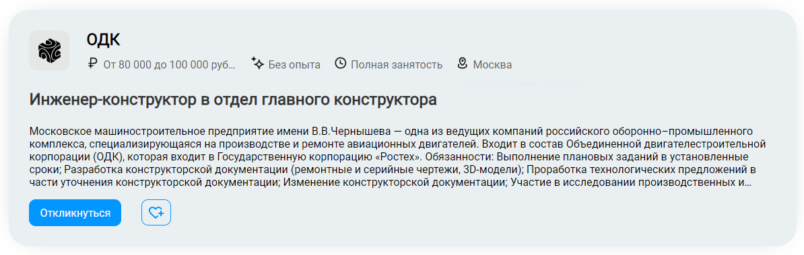
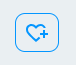

# Домашнее задание 1 <!-- omit from toc -->

## Содержание <!-- omit from toc -->

- [1 Соискатель](#1-соискатель)
  - [1.1 Страница авторизации](#11-страница-авторизации)
  - [1.2 Страница регистрации](#12-страница-регистрации)
  - [1.3 Хедер](#13-хедер)
  - [1.4 Список вакансий](#14-список-вакансий)
    - [1.4.1 Фильтры](#141-фильтры)
    - [1.4.2 Список](#142-список)

Проект доступен по [ссылке](http://212.233.90.231:8085/vacs).

## 1 Соискатель

### 1.1 Страница авторизации

Форма авторизации соискателем представлена на рисунке

- поле `Электронная почта`:

  - валидация происходит по регулярному выражению `/.+@.+\..+$g`

  - при ошибке валидации выводится соответсвующее сообщение об ошибке

    

  - при вводе одних пробелов в поле возникает следующее сообщение об ошибке

    

  - при вводе нескольких слов в поле, возникает следующее сообщение об ошибке

    

  - при валидном значении в поле сообщения не возникает

- <bug>⚠ BUG:</bug> при попытке отправки пустых полей в каждом поле возникает сообщение об ошибке

  

- при отправке неверных данных возникает общая ошибка

  

- при всех валидных заполненных полях сообщений об ошибках нет, пользователя редиректит на страницу с вакансиями

### 1.2 Страница регистрации

Форма регистрации соискателем представлена на рисунке

- поля формы `Имя`, `Фамилия`:

  - обязательные поля для заполнения, иначе, если не заполнены или заполнены пробелами, то выводится сообщения об ошибке

    

  - должны содержать одно слово, иначе выводится сообщение об ошибке

    

  - не должны содержать цифр, иначе выводится сообщение об ошибке

    

  - не должны быть длиннее 20 символов, иначе выводится сообщение об ошибке

    

- поле `Электронная почта`

  - валидация происходит по регулярному выражению `/.+@.+\..+$g`

  - должно содержать одно слово, иначе выводится сообщение об ошибке

    

  - при невалидном значении выводится сообщение об ошибке

    

  - в ситуации, когда пользователь с введенной электронной почтой уже существует, выводится общее сообщение об ошибке

    

  - при некорректном домене почты выведится общее сообщение об ошибке

    

- поле `Придумайте пароль`:

  - обязательное поле для заполнения
  - требования к сложности пароля:
    - должен быть от 6 до 128 символов в длину
    - должен содержать заглавные буквы
    - должен содержать цифры
  - при неудовлетварении требованиям сложности пароля выводится сообщение об ошибке

    

- поле `Повторите пароль`:

  - должно совпадать со значением в поле `Придумайте пароль`, иначе выводится сообщение об ошибке

    

- при отсутствии ошибок, сообщений нет, пользователя редиректит на страницу с вакансиями

### 1.3 Хедер

Хедер у авторизованного соискателя выглядит следующим образом

- лого содерижит ссылку на главную страницу сайта
- кнопка `Мои резюме` ведет на страницу с резюме пользователя
- кнопка `Соискатели` ведет на страницу со списком соискателей
- кнопка `Вакансии` ведет на страницу со списком доступных вакансий
- при нажатии на кнопку поиска появляется поисковая строка, все элеменры слева кроме лого скрываются

  
  
  - по кнопке слева можно установить, где будет происходить поиск
  - по кнопке справа выполняется сам поиск
  - по черной стрелке справа строка скрывается
- кнопка `Создать резюме` ведет на странцу создать резюме
- кнопка в виде сердца ведет к избранным вакансиям пользователя
- при нажатии на кнопку `бургер` иконка поворачивается на 90° и появляется всплывающее меню

  

  - кнопка `Профиль` ведет в раздел профиля пользователя
  - кнопка `Отклики` ведет в раздел откликов пользователя
  - <bug>⚠ BUG:</bug> кнопка `Сменить роль` переводит пользователя из соискателя в работодателя, если он создавал аккаунт с другой ролью до этого, иначе ведет на страницу создания новой роли для его электронной почты
  - кнопка `Выход из аккаунта` происходит разлогинивание пользователя

### 1.4 Список вакансий

Часть страницы со списком вакансий выглядит следующим образом

#### 1.4.1 Фильтры

- компонент с фильтрами располагается слева на странице
- сверху, над всеми фильтрами, показывается строка с количеством найденных вакансий, удовлетворяющих выбранным фильтрам 
- если фильтры никакие не выбраны, то выводятся все доступные вакансии, также сверху появляется кнопка сброса всех вакансий

  

- применение фильтров происходит в момент выбора фильтров, либо по нажатию соответствующей кнопки `Применить`
- у некоторых фильтров справа есть значения, которые показывают количество вакансий, соответствующих этому значению фильтра
  - <bug>⚠ BUG:</bug> обновление этих значений происходит следующим образом: значения одного конкретного фильтра рассчитываются для списка вакансий, к которому не применен текущий этот один конкретный фильтр

- фильтр `Город`
  - выводит список 5 самых популярных городов
  - слева от названия города выводится количество вакансий, соответвующих этому городу
  - при выборе города список вакансий обновляется
    
    
  
  - <bug>⚠ BUG:</bug> при вводе города, отсутствующего в списке, в строку, применение фильтра проиходит по нажатии кнопки `Применить`, при этом этот город появляется в списке
  
    

- фильтр `Уровень дохода`

  

  - если не был настроен, по умолчанию принимает значения от самого минимального во всем списке, до самого максимального
    - <bug>⚠ BUG:</bug> при применении других фильтров принимает значения, согласно изначальному полному списку
  - фильтр применяется по нажатии на кнопку `Применить`
  - <bug>⚠ BUG:</bug> при вводе невалидных значений (напрмер от большего к меньшего), выводится сообщение об ошибке
  - при регулировании уровня зарплат ползунками, выставить невалидные значения не получится
  
- фильтры `Опыт работы`, `Тип занятости`, `Образование`

  

  

  

  - представляют список фильтров из значений, которые хоть раз встречаются в списке изначальном вакансий

#### 1.4.2 Список

- компонент со списком вакансий располагается в правой части страницы

  

- правая верхняя кнопка меняет тип карточек вакансий

  

- карточка вакансии
  
  

  - в карточке указано название компании и ее лого
  - в карточке указаны основные характеристики вакансии `Зарплата`, `Требуемый опыт`, `Занятость`, `Расположение`
    - при наведении на каждую из них появляется пояснение, что эта иконка означает

      

  - в карточке указано название вакансии
  - в карточке дано сокращенное описание вакансии с многоточием в конце, если текста слишком много
  - при нажатии на кнопку `Откликнуться` пользователя переводит на страницу выбора резюме для отклика
    - <bug>⚠ BUG:</bug> при отклике на вакансию и успешном выполнении дальнейших действий, пользователя возвращает обратно на ту же страницу со списком вакансий, со всеми исходными фильтрами
  - при нажатии на кнопку `сердце с плюсом`, вакансия добавляется в избранное и кнопка меняется на `сердце с минусом`, аналогично работает и в обратную сторну

    

    

    - в дальнейшем все вакансии, которые добавлены в избранное, по-умолчанию отображают кнопку `сердце с минусом`

- пагинатор

  

  - <bug>⚠ BUG:</bug> отображает текущую страницу, количество всех страниц и часть соседних страниц
